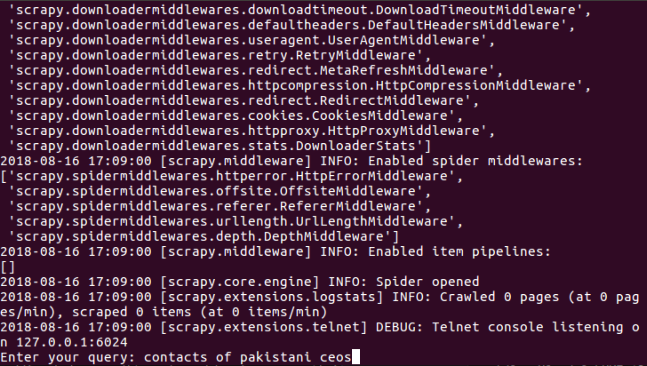
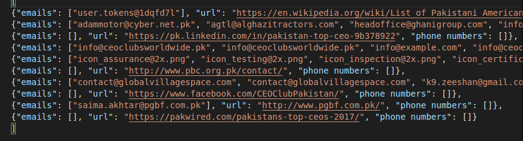

# Python-Scrapy-Email-Phone-Number-Crawler
This python script search/google certain keywords, crawls the webpages from the results, and return all emails & phone numbers found.
<br>
Sometime we cant find the emails of persons relevant to our business, we need a way to find emails of our relevant persons
this repository can help
<br>
## Getting Started

To use this repo just clone/download the repository, download Miniconda3. 

### Prerequisites

Things required<br>
1. Miniconda3
2. Git Bash
3. Clone repository, open Git Bash, cd to the desired install location/path (perhaps your Documents folder): 
```python
git clone https://gitlab.cloud.eemagine.com/jaftreth/bdp-code.git
 ```
4. Install all required packages, open Anaconda Prompt: 
  ```python
  conda env create -n bdp --file environment.yml
  ```
5.  ```python
  conda activate bdp
  ```
### Usage
1. If not already open, open Anaconda prompt
```python
conda activate bdp
  ```
2. cd to the location/path where the repository was installed.
3. Start the scrapy crawler script
  ```python
  scrapy crawl emailspider -o output.json
  or
  scrapy crawl emailspider -o output.csv  
  ```
4. Start the search with a keyword(s). I used "contacts of ceos in Pakistan" as an example. 
5. Suggested keywords also include: revenue, invested money, price, contacts



The search and crawling process will take quite a while as it retrieves maximum results from Google & try to crawl all of them.
After the process finished, you can see output in specified file



## Built With

* [Scrapy](https://scrapy.org/) - The main framework for this crawler

## Contributing

Feel free to submit pull requests to me.


## Authors

* **Joel Aftreth** **Muhammad Haseeb** - *Initial work* - [Muhammad Haseeb]


## License

This project is licensed under the MIT License - see the [LICENSE](LICENSE) file for details
